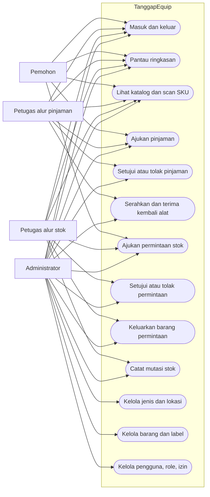
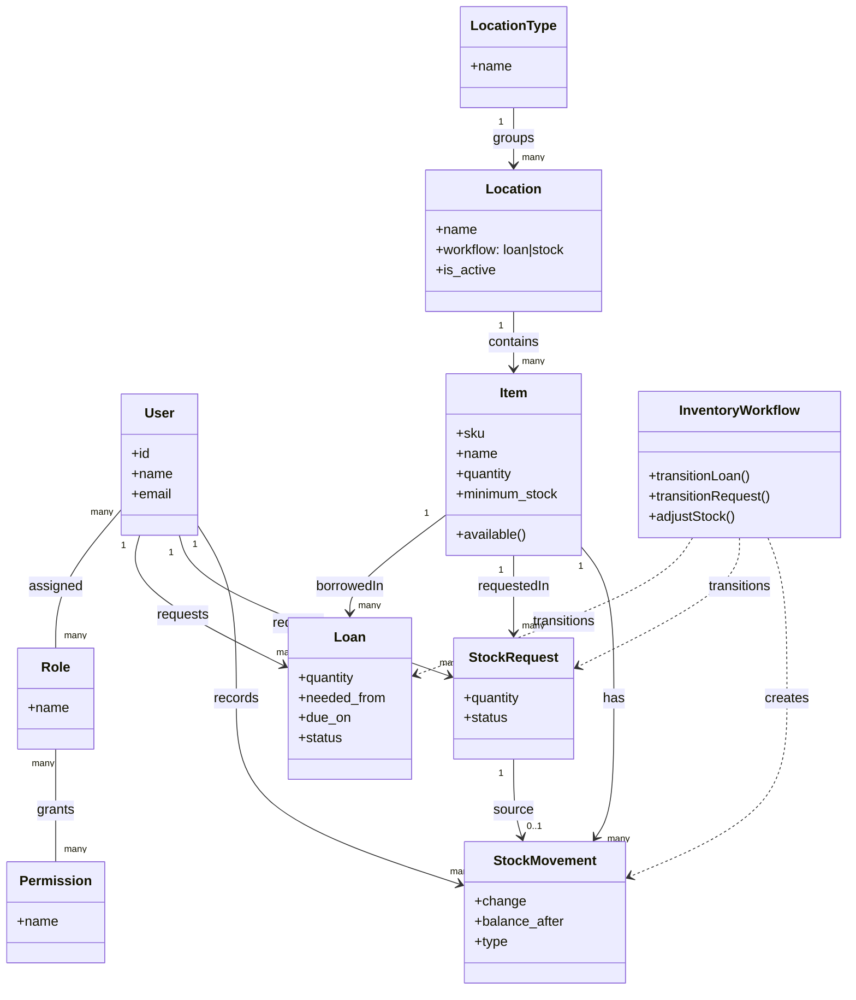
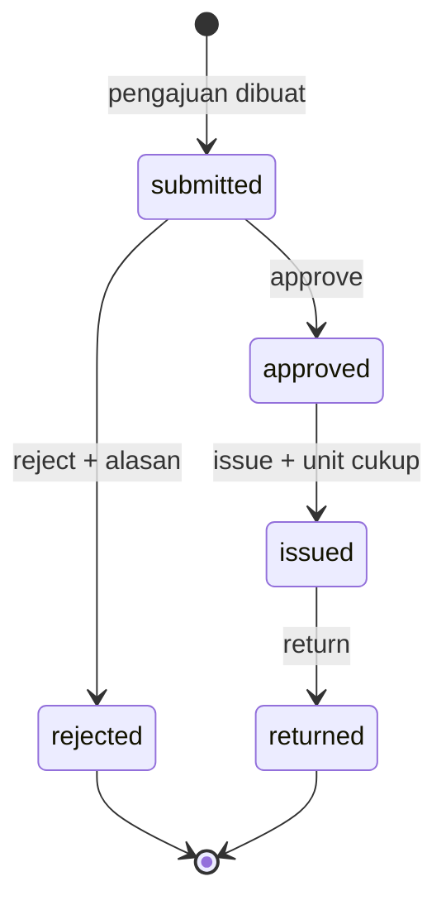
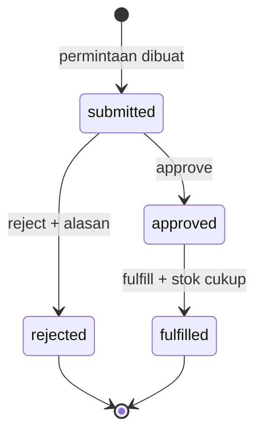
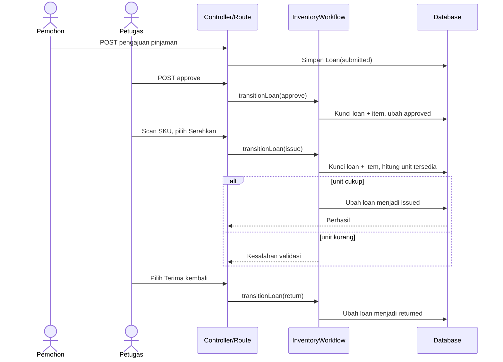
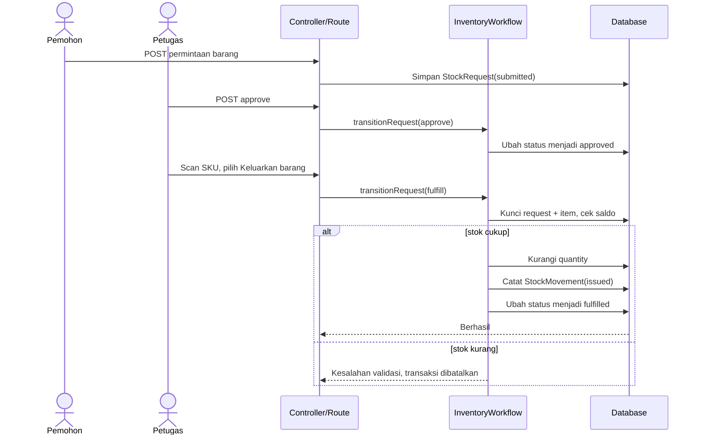
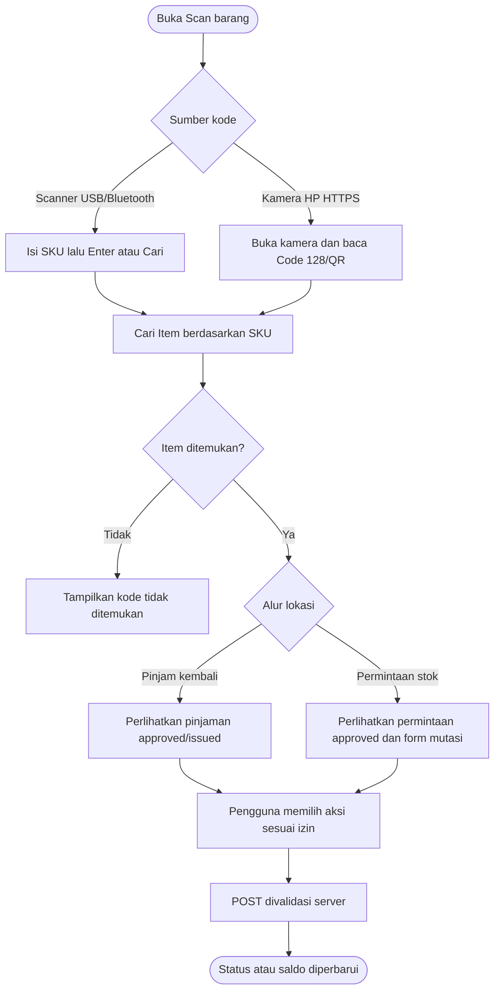

# UML TanggapEquip

Diagram berikut menggambarkan implementasi saat ini. Kode status (`submitted`, `approved`, dan seterusnya) mengikuti nilai yang disimpan di database. Diagram Mermaid dapat dirender oleh penampil Markdown yang mendukung Mermaid. Sumber [diagram use case UML formal](uml/USE_CASE.puml) tersedia dalam PlantUML.

## 1. Diagram use case

Diagram ini menunjukkan hubungan aktor dan use case. Role dapat diubah melalui Spatie; garis di atas merepresentasikan izin bawaan, bukan izin yang harus tetap pada nama role tersebut.

## 2. Diagram kelas/domain

Relasi pelaku persetujuan, penyerahan, pengembalian, dan pemenuhan juga menunjuk `User` melalui kolom `approved_by`, `issued_by`, `returned_by`, atau `fulfilled_by`; garisnya disederhanakan agar diagram terbaca.

## 3. Diagram status pinjaman

`issued` mengurangi ketersediaan yang dihitung dari total alat. `returned` melepaskan jumlah itu kembali. Tidak ada perubahan `items.quantity` pada kedua langkah.

## 4. Diagram status permintaan stok

Saldo stok dan satu catatan mutasi `issued` dibuat saat `fulfilled`, bukan saat `approved`.

## 5. Diagram urutan penyerahan alat

## 6. Diagram urutan pemenuhan permintaan stok

## 7. Diagram aktivitas scan

Scan adalah pencarian item. Tindakan pada hasil scan tetap mengikuti izin, urutan status, dan pemeriksaan saldo pada server. Rincian kondisi ada di [use case](USE_CASES.md) dan [panduan kode](PANDUAN_KODE.md).
